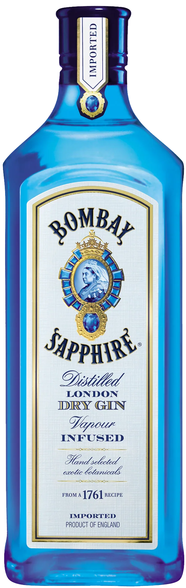
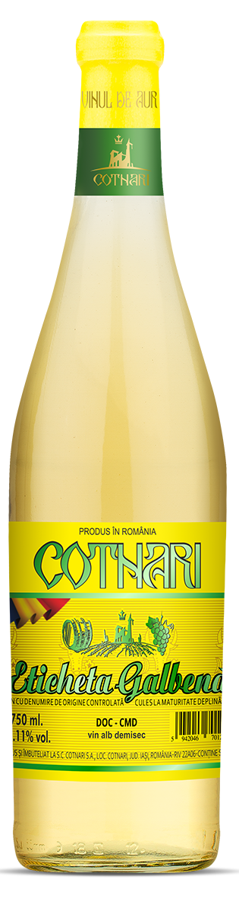
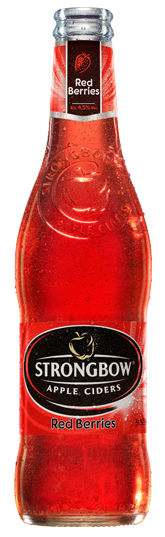

# Sahalin Gulag Slots Simulator

This is the mandatory project required for the object-oriented programming course (OOP) in the 
second year at Technical University of Cluj-Napoca. Its purpose is to familiarize one with the
Java programming language, a Java IDE (BlueJ is recommended, but I have used IntelliJ) and the
object-oriented programming paradigms. There was no theme to choose from, but at the laboratory
we were presented a project that implemented some betting app and this may be why I chose to do 
something kind of similar. Moreover, some time ago I have seen some other [YouTube video about the 
history of slot machines](https://youtu.be/nt1Qmze8cPg) that convinced me to investigate
this topic further.  
(In addition to that I may have a gambling + alcohol ~~addiction~~ dedication. *joke*)

## Table of Contents

- [Description](#Description)
- [Installation](#installation)
- [Usage](#usage)
- [Further developments](#Further-developments)
- [License](#license)

## Description

The project is based on Java and Qt Jambi. I chose Qt Jambi over Java Swing or JavaFX for the GUI because (*not joke*):
- I had a lot of trouble in installing the JavaFX with Maven (self-explanatory this was my first time using Java)
- Everyone said Java Swing is outdated
- Never before have I worked with this kind of tools or done any GUI
- Some guys on StackOverflow said Qt is better

The purpose of the project is to simulate a classic slot machine with some changes:
- I have replaced the classic fruit, scatter and jackpot symbols with different bottles of alcoholic, commercial beverages   
- There is no real money input required; money or points can be added in the simulator by means of some buttons //TO DO
- There is only one "account" that does not save the balance of the account when the app is closed. Each time
the application starts, the sold in the account is set to 1000.
- The original slot machine has mechanically based behavior meaning that the symbols are placed on a circular gear that
is set to motion based on a lever that the player uses. The symbols are placed in a certain order that does not change based
on how many times I play. My simulation uses a (pseudo)random number generator (Rand class provided by Java) to replicate 
the randomness of the real slot machine. This implies that there is not a fix order of the symbols I use (any symbol can precede/succeed
or be preceded/succeeded by any other symbol). The immediate result is that the outcome of each "Roll" is rather a loss than a win. 

The symbols are grouped into 4 categories based on the priorities of the symbols defined in the classic game. These tiers differentiate 
themselves by the reward they each give. Tier 1 (Jackpot) returns up to 10,000 x betAmount, while the Tier 4 return at most 10 times the 
amountBet.

- First Tier - 1 symbol corresponding to the jackpot symbol in the classic game
  
  
   

- *There is no scatter symbol unlike in the classic game*
   

- Second Tier - 2 symbols
  
  
   
  
   

- Third Tier - 3 symbols

   
   
  
   
  
   

- Fourth Tier - 4 symbols
  
  
   
  
   
  
   
  
   

The reward system is based on the number of identical tier symbols that appear in the **middle row**.
- 3 identical symbols of
  - Tier 1 -> x 10,000
  - Tier 2 -> x 1,000
  - Tier 3 -> x 100
  - Tier 4 -> x 10
- 2 identical symbols of  
  - Tier 1 -> x 10
  - Tier 2 -> x 5
  - Tier 3 -> x 1.25
  - Tier 4 -> x 0.5
- no identical symbols -> all points are lost, no return

Detailed description of the project, its purpose, features, and functionalities.

## Installation

Instructions on how to install the project, including any dependencies and setup required.

## Usage

Guidelines and examples on how to use the project, including code snippets or commands.

## Further developments

Guidelines for contributors, including instructions for how to contribute, code of conduct, and the contribution process.

## License

Information about the project's license. Specify the type of license and include any necessary disclaimers or notices.

## Additional Sections (Optional)

All the images are available on the internet for free use. None is mine. 
- Troubleshooting
- FAQs
- Credits
- Changelog
